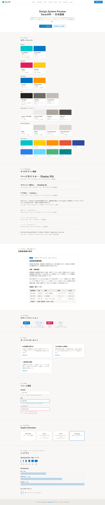
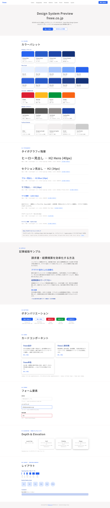
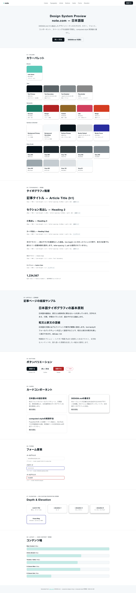
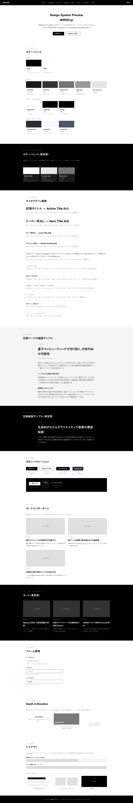

# Awesome Design MD JP

> A curated collection of `DESIGN.md` files for Japanese web services — enabling AI agents to generate accurate Japanese UI with proper typography, font stacks, and typographic rules.

**[English](#english) | [日本語](#日本語)**

---

## English

### What is DESIGN.md?

[DESIGN.md](https://stitch.withgoogle.com/docs/design-md/overview/) is a format introduced by Google Stitch — a plain-text markdown file that AI agents read to generate consistent UI. It sits alongside `AGENTS.md` (how to build) as `DESIGN.md` (how it should look and feel).

### Why a Japanese Edition?

The existing [awesome-design-md](https://github.com/VoltAgent/awesome-design-md) covers 55+ Western services but has **zero coverage of Japanese typography**. Japanese UI requires fundamentally different typographic specifications:

- **CJK font-family fallback chains** (和文 → 欧文 → generic)
- **Higher line-height** (1.5–2.0 vs Western 1.4–1.5)
- **Japanese letter-spacing** (0.04–0.1em for body text)
- **Kinsoku shori (禁則処理)** — line-break rules for CJK punctuation
- **OpenType features** (`palt`, `kern`) for proportional Japanese typesetting
- **Mixed typesetting (混植)** — rules for combining Japanese and Latin typefaces

Without these specifications, AI agents produce Japanese UI with broken typography — wrong fonts, cramped line-height, and mishandled punctuation.

### Included Sites

| Service | Category | DESIGN.md | Preview |
|---------|----------|-----------|---------|
| [SmartHR](https://smarthr.jp/) | HR SaaS | [DESIGN.md](design-md/smarthr/DESIGN.md) | [preview.html](design-md/smarthr/preview.html) |
| [freee](https://www.freee.co.jp/) | Fintech SaaS | [DESIGN.md](design-md/freee/DESIGN.md) | [preview.html](design-md/freee/preview.html) |
| [note](https://note.com/) | Media Platform | [DESIGN.md](design-md/note/DESIGN.md) | [preview.html](design-md/note/preview.html) |
| [WIRED.jp](https://wired.jp/) | Tech Media | [DESIGN.md](design-md/wired/DESIGN.md) | [preview.html](design-md/wired/preview.html) |

### Previews

<table>
<tr>
<td align="center"><strong>SmartHR</strong><br>ウォームグレー / 游ゴシック<br></td>
<td align="center"><strong>freee</strong><br>ブルー基調 / Noto Sans JP<br></td>
</tr>
<tr>
<td align="center"><strong>note</strong><br>クールグレー / 明朝体オプション<br></td>
<td align="center"><strong>WIRED.jp</strong><br>モノトーン / WiredMono<br></td>
</tr>
</table>

### Template

Use [`template/DESIGN.md`](template/DESIGN.md) to create your own Japanese DESIGN.md. It extends the standard 9-section format with detailed Japanese typography subsections.

---

## 日本語

### DESIGN.md とは

[DESIGN.md](https://stitch.withgoogle.com/docs/design-md/overview/) は Google Stitch が提唱するフォーマットで、AIエージェントが一貫したUIを生成するためのデザイン仕様書です。プレーンテキストのMarkdownで記述し、コードベースに `AGENTS.md`（作り方）と並べて `DESIGN.md`（見た目と雰囲気）として配置します。

### なぜ日本語版が必要か

既存の [awesome-design-md](https://github.com/VoltAgent/awesome-design-md) は欧米の55以上のサービスをカバーしていますが、**日本語タイポグラフィの仕様は完全に欠落しています**。日本語UIには根本的に異なるタイポグラフィ仕様が必要です：

- **和文フォントのフォールバックチェーン**（和文 → 欧文 → generic）
- **広い行間**（line-height 1.5〜2.0、欧文の1.4〜1.5とは異なる）
- **日本語の字間**（本文に0.04〜0.1em程度）
- **禁則処理**（句読点や括弧の行頭・行末ルール）
- **OpenType機能**（`palt`, `kern` によるプロポーショナル組版）
- **混植ルール**（和文と欧文の組み合わせ規則）

これらの仕様がなければ、AIエージェントは間違ったフォント、詰まった行間、壊れた句読点処理の日本語UIを生成してしまいます。

### プレビュー

各 DESIGN.md のデザイントークンを可視化したショーケースページ（`preview.html`）を同梱しています。

<table>
<tr>
<td align="center"><strong>SmartHR</strong><br>ウォームグレー / 游ゴシック<br></td>
<td align="center"><strong>freee</strong><br>ブルー基調 / Noto Sans JP<br></td>
</tr>
<tr>
<td align="center"><strong>note</strong><br>クールグレー / 明朝体オプション<br></td>
<td align="center"><strong>WIRED.jp</strong><br>モノトーン / WiredMono<br></td>
</tr>
</table>

### テンプレートの使い方

1. [`template/DESIGN.md`](template/DESIGN.md) をコピー
2. 各セクションを対象サービスの実際のCSS値で埋める
3. セクションヘッダーは英語のまま（AIエージェントの可読性のため）
4. 値の説明やDo's and Don'tsは日本語で記述

### セクション構成

テンプレートは以下の9セクションで構成されています（標準フォーマットを日本語タイポグラフィ向けに拡張）：

1. **Visual Theme & Atmosphere** — 視覚テーマと雰囲気
2. **Color Palette & Roles** — カラーパレットと役割
3. **Typography Rules** — タイポグラフィ（日本語拡張の核心）
   - 3.1 和文フォント
   - 3.2 欧文フォント
   - 3.3 font-family指定（フォールバック込み）
   - 3.4 文字サイズ・ウェイト階層
   - 3.5 行間・字間
   - 3.6 禁則処理・改行ルール
   - 3.7 OpenType機能
   - 3.8 縦書き（該当する場合）
4. **Component Stylings** — コンポーネントスタイル
5. **Layout Principles** — レイアウト原則
6. **Depth & Elevation** — 深度と影
7. **Do's and Don'ts** — デザインガードレール
8. **Responsive Behavior** — レスポンシブ挙動
9. **Agent Prompt Guide** — エージェント向けプロンプトガイド

### トークン抽出ツール

`scripts/extract-tokens.mjs` で、任意のサイトからデザイントークンを自動抽出できます。

```bash
npm install
npm run extract -- --out results.json https://example.com/
```

詳細は [CONTRIBUTING.md](CONTRIBUTING.md) を参照してください。

### コントリビュート

日本語サービスの DESIGN.md 追加を歓迎します。[CONTRIBUTING.md](CONTRIBUTING.md) を参照してください。

---

## License

[MIT](LICENSE)
